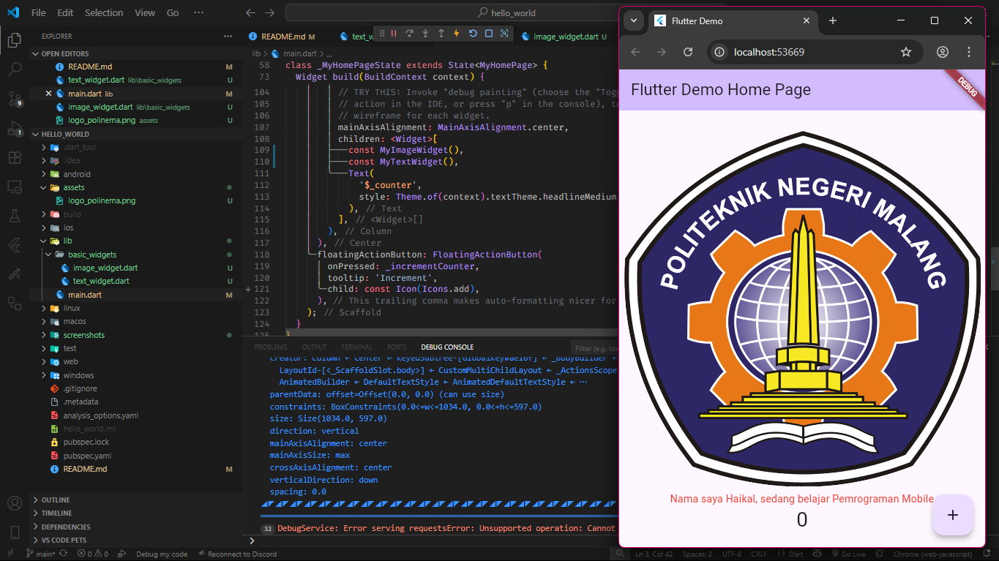

# LAPORAN PRAKTIKUM WEEK 05 - HELLO WORLD

## PRAKTIKUM

### PRAKTIKUM 1

**PENJELASAN :**
Membuat project flutter baru dengan nama hello_world

### PRAKTIKUM 2

**PENJELASAN :**
Menjalankan project di android device

### PRAKTIKUM 3

**PENJELASAN :**
Mengpush project hello_world ke dalam repository mobile

**PENJELASAN :**
Menjalankan project di browser dengan debugging

### PRAKTIKUM 4

**PENJELASAN :**
Membuat text_widget dan image_widget di folder basic_widgets dan digunakan pada halaman main

### PRAKTIKUM 5

**PENJELASAN :**
Implementasi menggunakan scaffold widget untuk mengatur tata letak sesuai dengan material design

**PENJELASAN :**
Implementasi menggunakan dialog widget untuk menampilkan modal dialog ketika button di tekan

**PENJELASAN :**
Implementasi menggunakan form input dan selection widget

**PENJELASAN :**
Implementasi menggunakan date and time pickers

## TUGAS PRAKTIKUM

### MEMBUAT PRAKTIKUM 5 MENJADI BASIC WIDGETS
