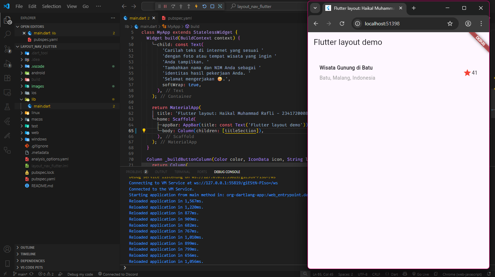
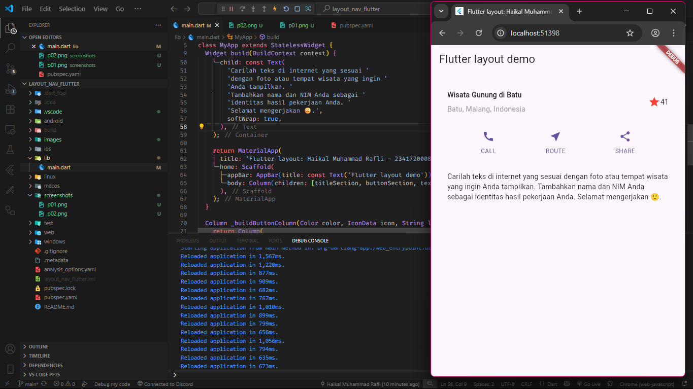
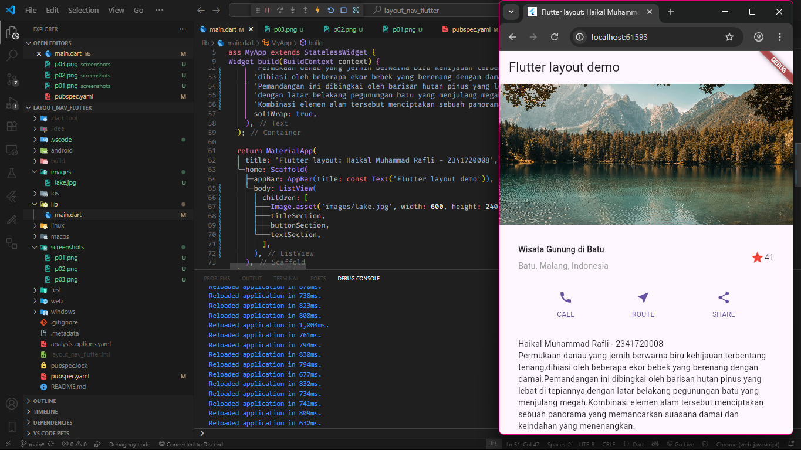

# LAPORAN PRAKTIKUM WEEK 06 - LAYOUT

## PRAKTIKUM

### PRAKTIKUM 1

**PENJELASAN :**
Membuat project flutter baru dan membuat title section

### PRAKTIKUM 2

**PENJELASAN :**
Membuat bottom navbar

### PRAKTIKUM 3

**PENJELASAN :**
Membuat text section

### PRAKTIKUM 4

**PENJELASAN :**
Membuat image section
