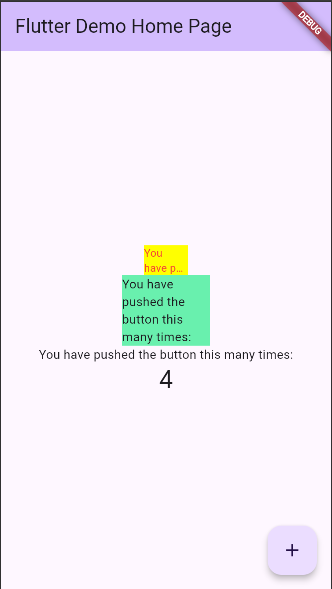

# LAPORAN PRAKTIKUM WEEK 07 - PLUGIN

## PRAKTIKUM

### PRAKTIKUM 1

**PENJELASAN :**
Membuat project flutter baru dan membuat red text widget yang menggunakan plugin auto size text.

## TUGAS PRAKTIKUM

### 1) Jelaskan maksud dari langkah 2 pada praktikum tersebut!
Langkah 2 merupakan menjalankan perintah command line yang menambahkan plugin auto_size_text ke dalam project.

### 2) Jelaskan maksud dari langkah 5 pada praktikum tersebut!
Langkah 3 merupakan membuat widget baru yang memiliki parameter cotructor atau widget dengan variable yang perlu ditambahkan pada saat pembuatan widget di file lainnya.

### 3) Pada langkah 6 terdapat dua widget yang ditambahkan, jelaskan fungsi dan perbedaannya!
Perbedaannya adalah salah satu menggunakan widget Text() biasa dan satunya lagi menggunakan RedTextWidget yang sudah dibuat sebelumnya dengan menggunakan plugin auto size widget.

### 4) Jelaskan maksud dari tiap parameter yang ada di dalam plugin auto_size_text berdasarkan tautan pada dokumentasi ini !
AutoSizeText berfungsi dan bersifat seperti widget Text() pada umumnya tetapi memiliki fungsi tambahan untuk meresize text agar sesuai dengan dengan batasan widget parentnya.