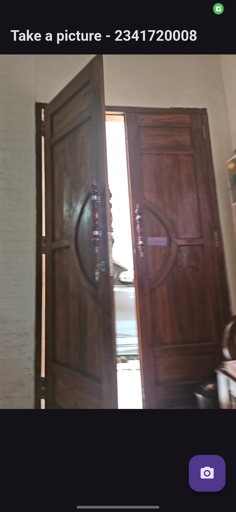
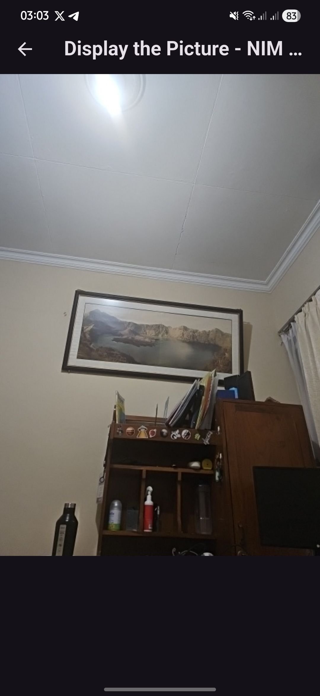
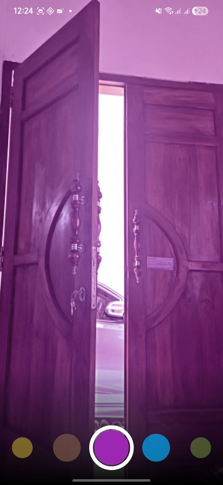

# LAPORAN PRAKTIKUM WEEK 09 - KAMERA

## PRAKTIKUM

### PRAKTIKUM 1

**PENJELASAN :**
Membuat project flutter baru dan membuat screen pengambilan foto dengan kamera dan menampilkan hasilnya di halaman preview.

### PRAKTIKUM 2

**PENJELASAN :**
Membuat halaman untuk menggunakan filter pada hasil pengambilan foto.

## TUGAS PRAKTIKUM

### 2) Gabungkan hasil praktikum 1 dengan hasil praktikum 2 sehingga setelah melakukan pengambilan foto, dapat dibuat filter carouselnya!

### 3) Jelaskan maksud void async pada praktikum 1?
Maksud dari sintaks async adalah untuk membuat sebuah fungsi menjadi asynchronus, sehingga bisa menjalankan operasi yang butuh waktu tanpa menghentikan ui.

### 4) Jelaskan fungsi dari anotasi @immutable dan @override ?
- @immutable: Berfungsi untuk menandai fungsi dibawahnya bersifat final dan tidak bisa diubah.
- @override: Berfungsi untuk menimpa fungsi yang dimiliki oleh parent class.
