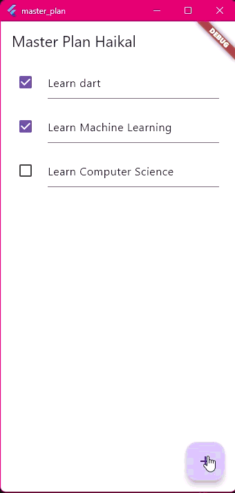
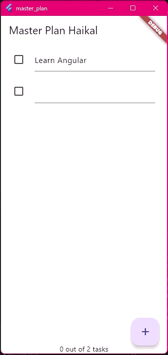

# LAPORAN PRAKTIKUM WEEK 09 - KAMERA

## PRAKTIKUM

### PRAKTIKUM 1
 
**PENJELASAN :**
Membuat project task planner flutter baru.

### PRAKTIKUM 2
 
**PENJELASAN :**
Mengelola Data Layer dengan InheritedWidget dan InheritedNotifier.

### PRAKTIKUM 3
 
**PENJELASAN :**
Membuat State di Multiple Screens.